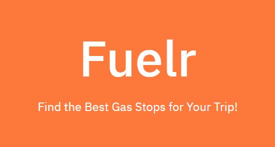

# Fuelr


# How to Use
Clone this repository:
```
git clone https://github.com/fwang356/Fuelr.git
```
Create a virtual environment:
```
virtualenv venv
```
Activate the environment:
```
venv/Scripts/activate
```
Install the dependencies:
```
pip install -r requirements.txt
```
Run the app:
```
python app.py
```

Input the required info and view your best gas stops!
